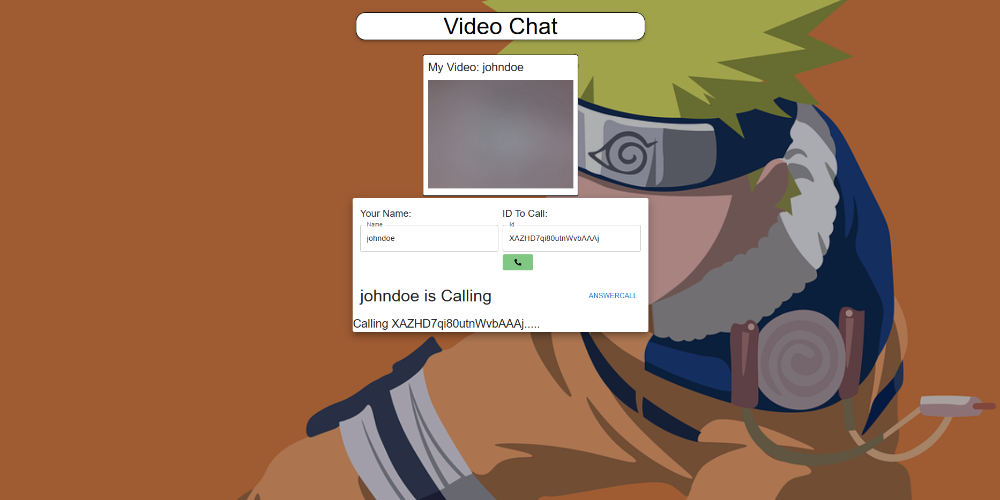
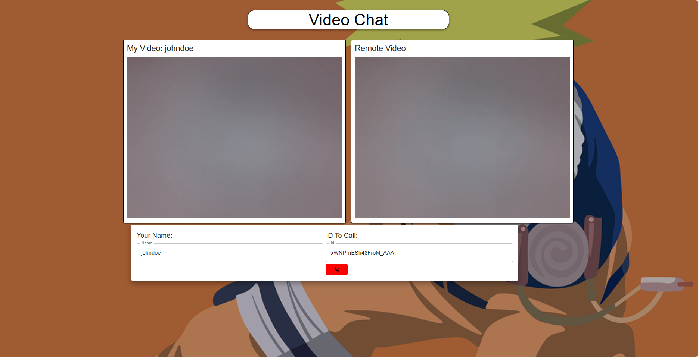

# Video Chat App with Peer.js

Welcome to the MERN Video Chat App with Peer.js! This application allows users to engage in seamless video calls using the power of the MERN stack (MongoDB, Express, React, Node.js) and the Peer.js library. Stay connected with friends, family, and colleagues through high-quality video communication. This README provides an overview of the app's features, installation steps, and screenshots.

## Features

- **Real-time Video Calls**: Enjoy high-quality, real-time video calls with your contacts.
  


## Screenshots



*Fig. 1: Contact Management - Manage your contacts and their status.*


*Fig. 2: Video Call - Engage in real-time video conversations.*


## Installation

1. **Clone the Repository**:

   ```bash
   git clone https://github.com/bk201grsameer/Video-Call-app.git
   cd Video-Call-app-app
   ```

2. **Install Dependencies**:

   ```bash
   cd client
   npm install
   cd ../server
   npm install
   ```

3. **Set Environment Variables**:

   Rename `.env.example` to `.env` in both the `client` and `server` directories. Add your configuration values, such as MongoDB connection URI and JWT secret.

4. **Run the App**:

   In one terminal, start the client:
   
   ```bash
   cd client
   npm start
   ```

   In another terminal, start the server:
   
   ```bash
   cd server
   npm start
   ```

5. **Access the App**:

   Open your web browser and visit `http://localhost:3000` to use the app.

## Support and Issues

If you encounter any issues or have questions, please [open an issue](https://github.com/your-username/mern-video-chat-app/issues) on GitHub.

## Contributing

Contributions are welcome! If you'd like to contribute to the project, please follow the guidelines in the [CONTRIBUTING.md](/CONTRIBUTING.md) file.

## Reference Links
https://github.com/adrianhajdin/project_video_chat

## License

This project is licensed under the [MIT License](/LICENSE).
---
